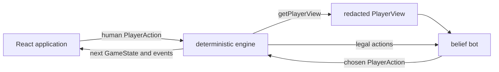

# Architecture

[Back to the project overview](../README.md)

The codebase separates game rules, strategy, and presentation. This keeps the
engine easy to test, prevents the bot from reading hidden cards, and lets the UI
change without altering the rules.

## Design goals

- Keep rule resolution deterministic and independent of React.
- Represent legal and illegal states with explicit TypeScript types.
- Give every bot the same information it could have as a real player.
- Make random scenarios reproducible from a seed.
- Keep strategy replaceable: a bot implements one small interface.

## Layers

| Layer | Main files | Responsibility |
| --- | --- | --- |
| Engine | [`src/engine`](../src/engine) | Owns the full game state, legal-action generation, card effects, turn flow, scoring, and player-specific views. |
| Bots | [`src/bots`](../src/bots) | Chooses from legal actions using only a `PlayerView`. It may construct hypothetical states, but it never receives the real hidden state. |
| Application | [`src/app`](../src/app) | Owns the live game in React state, accepts human input, schedules visual sequences, and renders engine results. |
| Tooling | [`scripts`](../scripts) | Runs repeatable tournaments outside the browser. |

The engine has no dependency on the UI or bot modules. Both higher-level layers
depend on the engine's types and pure operations.

## State and action flow

The live `GameState` is the source of truth. A turn follows this sequence:

1. `drawCardForCurrentPlayer` moves the game from draw to play.
2. `getLegalActions` expands the active hand into every legal card, target, and
   Guard guess combination.
3. A human or bot selects one of those actions.
4. `applyAction` validates it again before changing state.
5. The card effect resolves, events are recorded, and the engine checks for a
   round or game winner.
6. If play continues, the engine advances to the next active player.

Keeping legal-action generation in one place means the UI, bots, tests, and
engine validation all use the same rule interpretation.

## Full state versus player view

`GameState` contains everything required to resolve the game: all hands, deck
order, the hidden burn card, knowledge gained by each player, and the complete
event log.

`PlayerView` is the bot-facing boundary. `getPlayerView` exposes:

- the acting player's own hand;
- public player status and discard piles;
- visible burned cards and the number of cards remaining;
- cards privately learned by that player; and
- public events such as plays, guesses, eliminations, and round results.

It does not expose another player's hand, the deck order, the hidden burn card,
private draws, or another player's Priest reveal. The bot API accepts a
`PlayerView` and a list of legal actions, rather than a `GameState`.

This boundary is also enforced inside simulations. When a sampled game reaches
another player's turn, that simulated player receives a newly generated
`PlayerView`; the rollout policy does not inspect the sampled hidden cards
directly.

## Events and private knowledge

The event model distinguishes public and private information:

- `PublicGameEvent` records turn starts, card plays, targets, Guard guesses,
  eliminations, tokens, and round results.
- `card-drawn` is present in the engine log but filtered out of player views.
- `card-revealed` records a Priest result, while `seenCards` exposes that result
  only to the player who learned it.

Knowledge is updated when a known card leaves a hand. King swaps and Prince
discards clear or replace stale knowledge so neither the UI nor a bot relies on
information that is no longer valid.

## Determinism

Initial setup and bot decisions use seeded pseudo-random number generators.
Given the same seed and action sequence, the engine produces the same deal and
state transitions. The benchmark harness uses this property to compare
strategies across repeatable rounds and alternating seats.

The engine functions return new state objects instead of mutating the incoming
state. That makes tests straightforward: arrange a state, apply one operation,
and compare the result.

## Engine modules

| File | Purpose |
| --- | --- |
| [`types.ts`](../src/engine/types.ts) | Cards, players, actions, phases, events, `GameState`, and `PlayerView` |
| [`constants.ts`](../src/engine/constants.ts) | Classic deck composition, card values, and token targets |
| [`setupRound.ts`](../src/engine/setupRound.ts) | Seeded deals and transitions between rounds |
| [`turnFlow.ts`](../src/engine/turnFlow.ts) | Draw behavior and Handmaid protection expiry |
| [`legalActions.ts`](../src/engine/legalActions.ts) | Countess restrictions, valid targets, and Guard guesses |
| [`applyAction.ts`](../src/engine/applyAction.ts) | Action validation, all card effects, elimination, and scoring |
| [`playerView.ts`](../src/engine/playerView.ts) | Redaction of full state into player-specific information |
| [`random.ts`](../src/engine/random.ts) | Seeded shuffle and random-number helpers |

## Extending the project

To add a strategy, implement the `Bot` interface in
[`src/bots/botTypes.ts`](../src/bots/botTypes.ts). The strategy receives a view
and legal actions and returns one action.

To change a rule, update legal-action generation and state resolution together,
then add an engine test for both legality and outcome. UI work should consume
the resulting state or event instead of reproducing the rule in React.

The data model supports two to four players, but the browser currently creates
one human and one bot. A multiplayer UI would need player setup, turn privacy,
and a presentation model that does not leave private information visible between
local turns.
